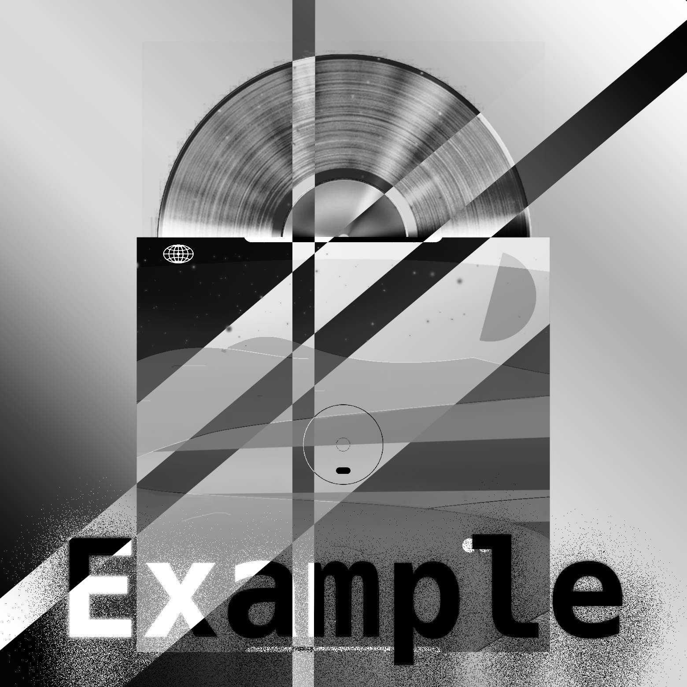
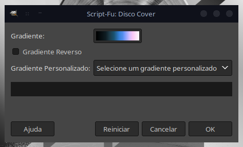

[](https://img.shields.io/github/languages/code-size/fabriciocybershell/Filter-Disco)


# Disco Cover Script-fu
este script é um Plug-in que serve para que outras pessoas possam aplicar minhas técnicas de forma automática, padronizada e procedimental, a intenção é replicar alguns efeitos com gradient-map que vi em imagens diversas pela internet, com alguns efeitos de coisas antigas com chuviscos e tons de cores específicas. consegui criar alguns gradientes personalizados, irei melhorar os existentes e adicionar mais.

o script anota as suas etapas no histórico de desfazer, e as mudanças são realizadas iguais a um procedimento feito manualmente, isso te permite estudar como o efeito é criado, e também a modificar e ajustar o efeito após ser aplicado, alterando os níveis de opacidade da camada de "Poeira", alterar seu modo de camada, e até mesmo a da camada "Disco Cover", mesclando as cores remapeadas com os tons da original.

Exemplos de antes (Imagem em escala de cinza) e depois (com filtro aplicado), funciona com imagens coloridas normalmente:
### Exemplos:
<p>
	
	
	
	
</p>
<p>
	
	
	
	
</p>
<p>
	
	
		
</p>

### Modo de acesso e uso:
Para encontrar o plugin, navege até: ``` Filtros > 90's Style > Disco Cover```
A forma de usar está meio confusa, mas é devido a algumas limitações quanto ao Script-fu que ainda será contornada.
Exemplificando:

a primeira seleção serve para você escolher entre todos os gradientes do gimp, incluindo os da extenção, porém, o input (Gradiente Personalizado) "```Selecione um gradiente personalizado```" agrupa apenas os criados para serem utilizados com esta extenção, se você selecionar algum deles, o Script irá ignorar a seleção do primeiro input (Gradiente), se você deixar o Gradiente personalizado selecionado na primeira opção "```Selecione um gradiente personalizado```", ele vai levar em consideração a seleção livre do primeiro input de gradiente.
a opção: "```Gradiente Reverso```" inverte a ordem de remapeamento de cores, a forma fáil dele fazer isso é inverter a cor da imagem de cópia original, e aplicar o efeito.

# instalação
para instalar, basta fazer: ```make instalar```, para remover, basta fazer: ```make desinstalar```, ele instalará em sua versão de gimp 2.*, não para a versão 1 e nem a 3, para o novo gimp, são necessários alguns testes adicionais, ele funciona, mas quebra, a versão recente solicita retornos de função inexistentes.
# instalação manual:
primeiro você deve mover os gradientes para o seu gimp, sem eles os gradientes que criei especialmente para este script não irão funcionar (apesar dele permitir você selecionar qualquer gradiente disponível pelo gimp).
mova para o diretório relacionado ao seu sistema, para Linux:
```${HOME}/.config/GIMP/version/gradients/```
para adicionar os scripts, você pode utilizar um diretório a sua escolha, ou usar o diretório padrão do gimp em:
```${HOME}/.config/GIMP/version/scripts/```
